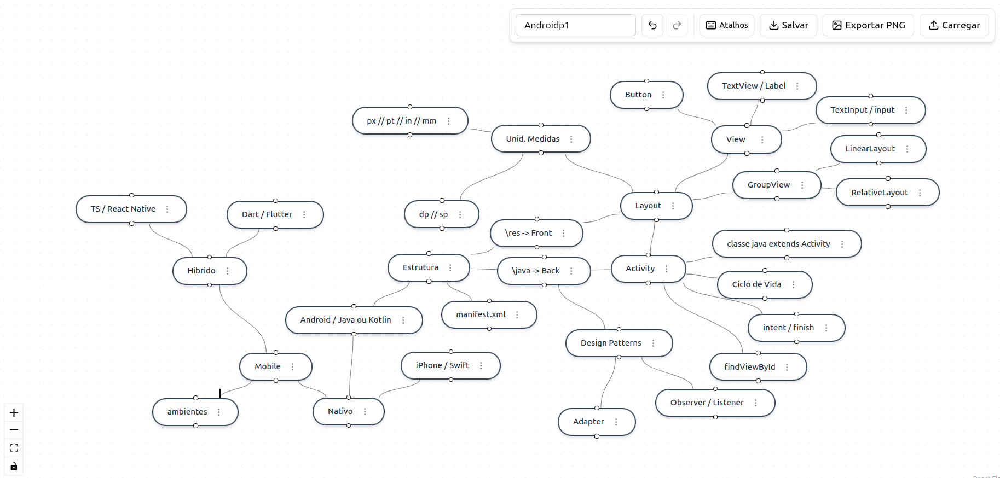

# 🧠 Interactive Mind Map & Flow Builder

Aplicação web interativa para criação, edição e visualização de mapas mentais e diagramas de fluxo dinâmicos. Desenvolvida em React e utilizando a biblioteca React Flow (`@xyflow/react`), a ferramenta oferece nós customizáveis no estilo "balão oval", conexões dinâmicas com seletores de cor e recursos de persistência de dados.

---

## 🚀 Funcionalidades

- **Nós Dinâmicos estilo Mapa Mental**:
  - Formato ovalado/pílula que ajusta sua largura automaticamente de acordo com o texto digitado.
  - Menu contextual individual por nó com opções para criar um nó filho, editar o rótulo e excluir.
- **Conexões Flutuantes (Floating Edges)**:
  - Cálculo dinâmico do ponto de conexão ideal entre os nós.
  - Suporte a mudança da cor das linhas através de um seletor rápido diretamente na conexão.
  - Possibilidade de mover/reconectar conexões existentes com o mouse.
- **Criação Rápida de Nó Central**:
  - Botão flutuante para adicionar novos nós no centro do viewport da tela sem sobreposição.
- **Persistência do Fluxo (Salvar/Carregar)**:
  - Exportação completa do estado do mapa (nós, conexões e viewport/zoom) em formato **JSON**.
  - Importação de arquivos JSON previamente salvos para restaurar o fluxo de trabalho.

---

## 🛠️ Tecnologias Utilizadas

- **[React](https://react.dev/)**: Biblioteca principal para a interface.
- **[TypeScript](https://www.typescriptlang.org/)**: Tipagem estática e segurança de código.
- **[React Flow / @xyflow/react](https://reactflow.dev/)**: Motor de diagramação e mapas interativos.
- **[Tailwind CSS](https://tailwindcss.com/)**: Estilização moderna e responsiva.
- **[Shadcn UI](https://ui.shadcn.com/) / Radix UI**: Componentes de interface (Dropdown Menu, Buttons).
- **[Lucide React](https://lucide.dev/)**: Conjunto de ícones vetoriais.
---

## 📦 Estrutura do Projeto

```text
src/
├── components/
│   ├── Connector.tsx              # Componente do Nó customizado (estilo mapa mental)
│   ├── FloatingConnectionLine.tsx # Linha guia temporária durante a criação de conexões
│   ├── FloatingEdge.tsx           # Linha de conexão customizada com menu de troca de cor
│   └── SaveLoadPanel.tsx          # Painel para exportar e importar o JSON do fluxo
├── utils.ts                       # Utilitários para cálculos geométricos das linhas flutuantes
├── App.tsx                        # Componente principal e configuração do React Flow
└── main.tsx                       # Ponto de entrada da aplicação
```

## Executar o projeto

Após clonar o projeto do Git você possui 2 opções para executar o projeto.


### A. Executar o projeto localmente

1. Na pasta executar o comando: npm install, para baixar as bibliotecas
2. Executar o comando: npm run dev.

Acessar no endereço: http://localhost:5173/



### B. Via Docker

1. docker build -t mindmap-app .
2. docker run -d -p 8080:80 --name meu-mindmap mindmap-app

Acessar no endereço: http://localhost:8080/
